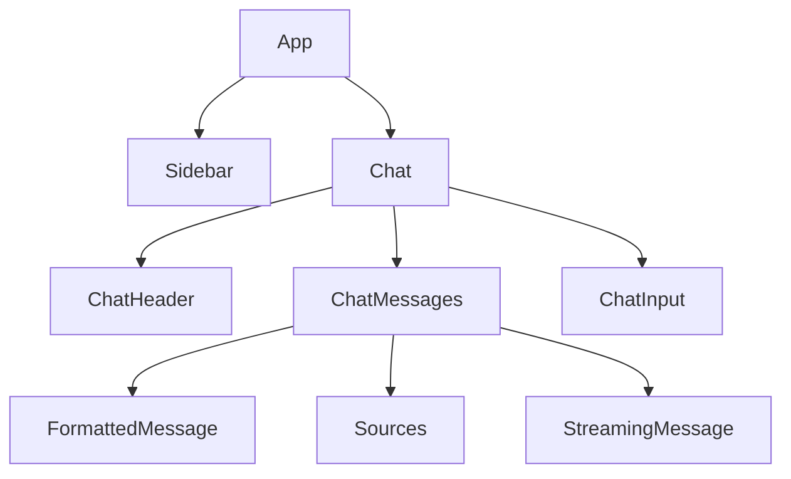
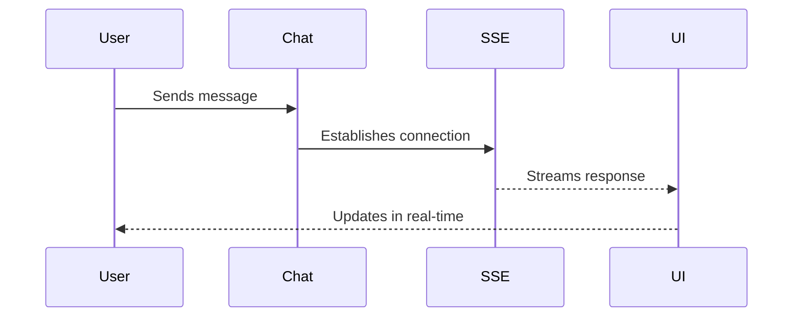
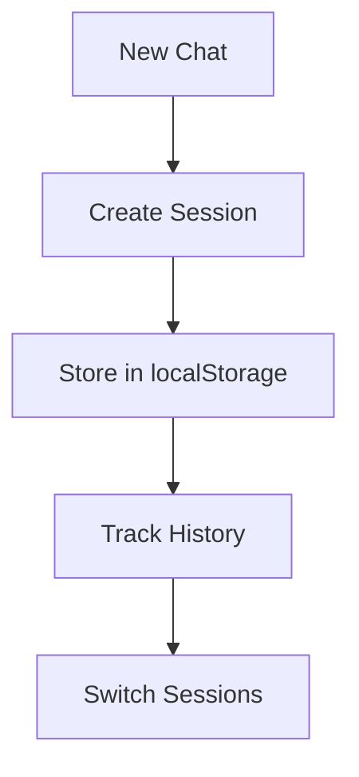

# News RAG Chat Application

A real-time news chat application that uses Retrieval-Augmented Generation (RAG) to provide accurate and contextual responses about current news events.

## 🚀 Features

- Real-time chat interface with streaming responses
- Session management with persistent chat history
- News article retrieval and context-aware responses
- Source attribution for all responses
- Modern UI with Tailwind CSS and shadcn components
- Responsive design for all devices

## 📋 Prerequisites

- Node.js (v16 or higher)
- Redis server
- Qdrant vector database
- OpenAI API key
- Gemini API key

## 🛠️ Tech Stack

### Frontend
- React
- Vite
- Tailwind CSS
- shadcn/ui components
- TanStack Query (React Query)
- Server-Sent Events (SSE)

### Backend
- Node.js
- Express
- Redis (Session Management)
- Qdrant (Vector Database)
- OpenAI Embeddings
- Gemini API

## 🔧 Installation

1. Clone the repository:
```bash
git clone https://github.com/Atmalviya/news-rag-fe
cd news-rag-fe
```

2. Install dependencies:
```bash
# Install frontend dependencies
npm install
```

## 📁 Project Structure

```

## 🔄 Component Flow



## 💡 Key Components

### 1. Chat Component


### 2. Session Management


## 🎨 UI Components

### Chat Interface
- Real-time message streaming
- Message formatting with headings
- Source attribution
- Loading states
- Error handling
- Auto-scrolling

### Sidebar
- Session management
- Chat history
- New chat creation
- Active session indication
- Session titles

## 🔑 Key Features Implementation

### 1. Streaming Responses


### 2. Session Management

## 🎯 Features

### 1. Real-time Chat
- Immediate message display
- Streaming responses
- Source attribution
- Message formatting

### 2. Session Management
- Multiple chat sessions
- Session persistence
- Session switching
- Clear chat functionality

### 3. UI/UX
- Responsive design
- Loading states
- Error handling
- Smooth animations
- Auto-scrolling

## 🔒 Security Considerations

- CORS configuration
- Input sanitization
- Error message handling
- Session validation

## 🚀 Performance Optimizations

- React Query for data fetching
- Efficient re-rendering
- Proper cleanup of event listeners
- Optimized state management
